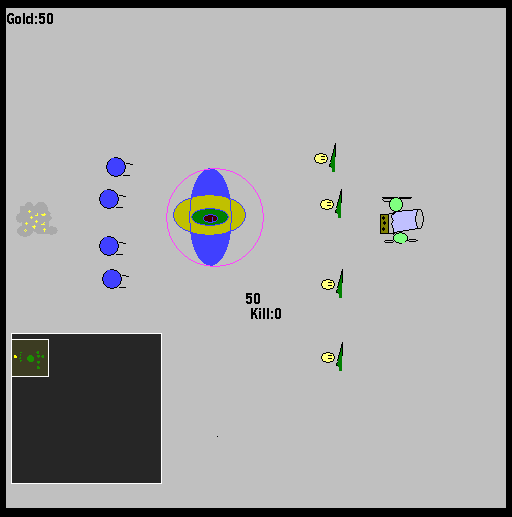

# 원크래프트

게임메이커로 만든 RTS다. 일꾼과 총병, 포병 유닛에 회관, 양성소, 벙커, 감시초소 건물, 골드 경제와 드래그 선택까지 RTS의 기본기를 갖췄고 미니맵도 있다. 중심은 맵에디터다. 지형과 유닛을 배치하고 자금과 승리 조건을 정한 뒤 트리거까지 걸어 맵으로 저장하고 공유할 수 있다.

  

## 플레이 방법

Releases에서 받아 압축을 풀고 실행한다. 게임이 같은 폴더의 GIF와 동영상 파일을 읽으므로 폴더째 풀어야 한다.

실행하면 메인 메뉴가 뜨고 시작하기를 누르면 에디터로 들어간다. 맵을 만들고 B 키로 저장하면 그 맵으로 게임이 시작된다. 만들어둔 맵은 에디터에서 N 키로 불러온다.

### 에디터

| 키 | 동작 |
|---|---|
| 스페이스 + 1 / 2 / 3 | 일꾼 / 총병 / 포병 |
| 스페이스 + 4 / 5 / 6 | 양성소 / 벙커 / 감시초소 |
| 스페이스 + Q / W / E | 나무 / 성벽 / 풀 |
| 스페이스 + A / S / D | 적 총병 / 적 포병 / 적 양성소 |
| 우클릭 / 좌클릭 | 배치 / 지우기 |
| Delete, Enter | 자원 없애기, 자원 생성 |
| Z / X | 적 양성소 자동 소환 켜기, 끄기 |
| O / P | 시작 자금 올리기, 내리기 |
| K / L | 승리 조건 킬 수 올리기, 내리기 |
| B / N | 저장, 불러오기 |
| Ctrl | 트리거 소환 |
| 마우스 가운데 버튼 | 트리거 지우기 |

트리거는 Ctrl로 불러낸 뒤 좌클릭으로 원하는 위치에 옮기고, 우클릭하면 어느 유닛에 적용할지 물어보면서 다음 단계가 이어진다.

### 인 게임

| 키 | 동작 |
|---|---|
| 스페이스 + 1 | 일꾼 (50원) |
| 스페이스 + 2 | 양성소 (200원) |
| 스페이스 + 3 | 벙커 (300원) |
| 스페이스 + 4 | 감시초소 (50원) |
| 양성소 클릭 + Q | 총병 (100원) |
| 양성소 클릭 + W | 포병 (250원) |
| F11 | 스크린샷 |

## 구현 원리

트리거는 조건과 동작을 오브젝트 폴더로 나눠 만들었다. "유닛이 지정한 곳에 가면"이 조건이고 "유닛이 만들어진다", "그림이 그려진다", "제거한다"가 동작이다. 조건 오브젝트가 발동하면 연결된 동작 오브젝트를 깨우는 식이라 트리거 하나가 오브젝트 여러 개의 묶음이 된다. 그림 트리거는 게임 폴더의 G1, H1, J1, K1, L1 GIF를 그대로 읽어 쓴다.

맵 저장은 배치 정보를 따로 파일 형식으로 만들지 않고 `game_save` 로 게임 상태 전체를 스냅샷으로 남긴다. 그래서 에디터에서 저장을 누르면 곧바로 그 상태에서 게임이 시작되는 흐름이 자연스럽게 나온다.

## 파일

| 경로 | 내용 |
|---|---|
| `source/woncraft.gmk` | 원본 프로젝트 파일 |
| `source/lib/AI.lib` | 적 감지에 쓴 액션 라이브러리. 게임메이커의 `lib` 폴더에 넣어야 프로젝트가 열린다 |
| `source/split/` | GmkSplitter로 분해한 텍스트 트리 |
| `docs/screenshots/` | 스크린샷 |
| Releases | 배포용 파일 |

## 크레딧

`source/split/Scripts/MDX-Minimap/` 의 스크립트는 Midx가 만든 MDX-Minimap 라이브러리다. `source/lib/AI.lib` 은 멍멍이(qw5628)님이 만든 액션 라이브러리다.

## 라이선스

CC BY-NC-ND 4.0 라이선스다. 출처를 밝히면 비상업 용도로 그대로 공유할 수 있고, 수정본 배포와 상업적 이용은 금지한다. 함께 들어 있는 것 중 다른 사람이 만든 라이브러리와 그림·소리·맵은 각자의 권리를 따른다. 자세한 내용은 [LICENSE](LICENSE) 에 있다.
